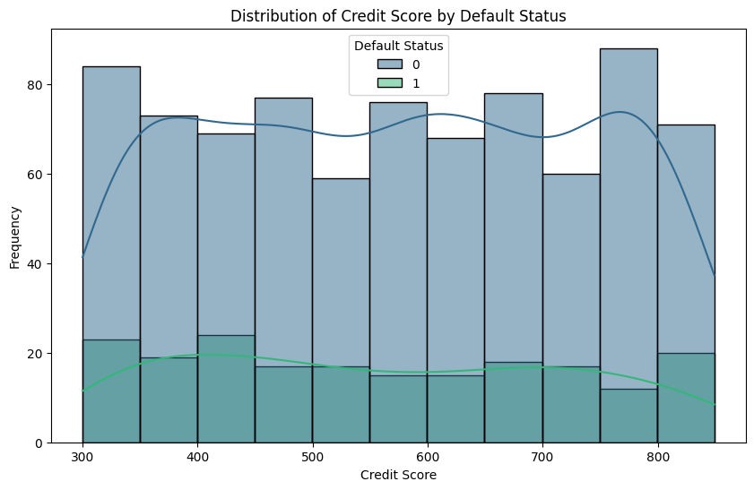
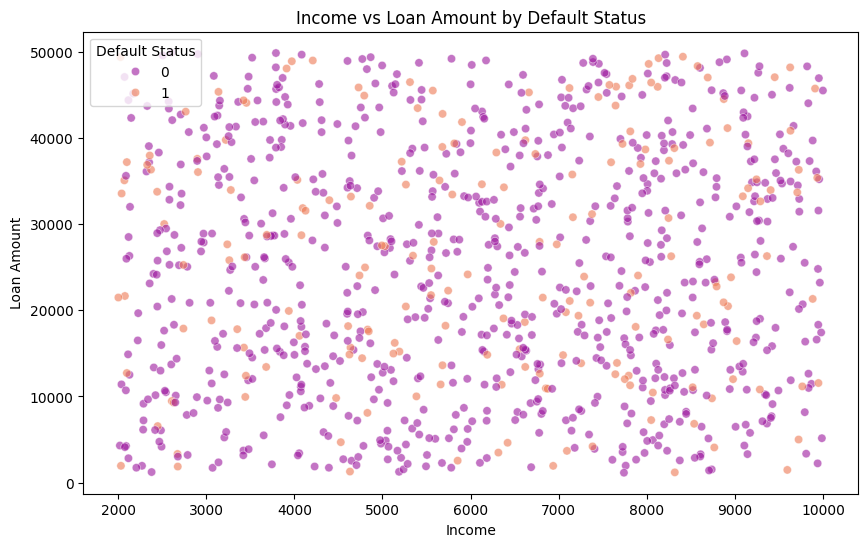
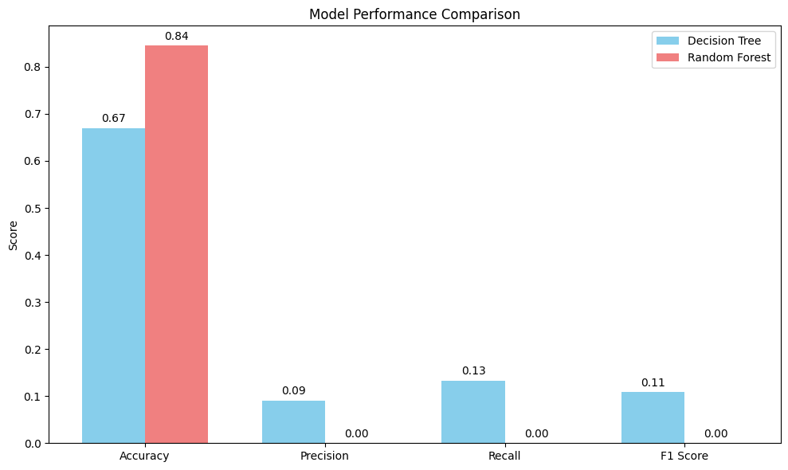

# Credit-Risk-Modeling-Decision-Tree-vs.-Random-Forest-Performance-Analysis---A-Case-Study
Case Study assessment January 19' 2024

## 🧾 Introduction
This report presents a comparative analysis of two machine learning models — **Decision Tree** and **Random Forest** — for predicting the creditworthiness of loan applicants. The objective is to determine which model performs better in identifying applicants likely to default on loans.

---

## Data Overview

The dataset consists of synthetic financial records representing loan applicants, with the following attributes:

- `Age`: Age of the applicant
- `Income`: Monthly income
- `Debt-to-Income Ratio`: Proportion of income used to service debts
- `Credit Score`: A score indicating creditworthiness
- `Employment Duration`: Number of years the applicant has been employed
- `Loan Amount`: Amount of loan requested
- `Default Status`: Target variable indicating whether the applicant defaulted (1) or not (0)

---

## Data Insight

- The dataset is clean and numeric, suitable for classification.
- Summary statistics reveal variation in income, credit scores, and loan amounts across applicants.
- A balanced representation of features ensures fair model evaluation.

---

## Data Preparation

- The target variable `Default Status` was separated from the feature set.
- The dataset was split into training and testing sets (80/20 split) to evaluate model performance on unseen data.
- No additional scaling or transformation was applied as tree-based models handle feature scaling internally.

---

## Model Training

Two models were trained and tested on the same dataset:

- **Decision Tree Classifier**
  - Criterion: `entropy`
  - Random state: `42`

- **Random Forest Classifier**
  - 100 estimators
  - Criterion: `entropy`
  - Random state: `42`

---

## Model Evaluation

Both models were evaluated using key classification metrics: **Accuracy**, **Precision**, **Recall**, and **F1 Score**.

| 🔍 Metric     | Decision Tree | Random Forest |
|---------------|----------------|----------------|
| **Accuracy**  | 0.6700         | 0.8450         |
| **Precision** | 0.0909         | 0.0000         |
| **Recall**    | 0.1333         | 0.0000         |
| **F1 Score**  | 0.1081         | 0.0000         |

---

## Graphical Insights

### Distribution of Credit Score by Default Status
> Applicants with **higher credit scores** are less likely to default, as indicated by the concentration of non-defaulters at the upper end of the credit score range.

---

### Income vs Loan Amount by Default Status
> Defaulters tend to cluster in the region of **low income and high loan amount**, whereas applicants with higher income and lower loans are generally safer.

---

### Model Performance Comparison
> While **Random Forest** achieves significantly higher accuracy, its **precision, recall, and F1 score are zero**, indicating it may have failed to detect any defaulters. **Decision Tree**, though less accurate overall, managed to identify some defaulters.

---

## Conclusion

- **Random Forest** achieved the highest **accuracy** (84.5%) but failed to identify any positive default cases, resulting in **zero precision, recall, and F1 score**.
- **Decision Tree**, while less accurate (67.0%), exhibited non-zero precision, recall, and F1 score, suggesting a slightly better ability to detect actual defaults.
- This comparison highlights a common issue in **imbalanced classification problems**, where a model may predict the majority class (non-default) to optimize accuracy, at the expense of detecting rare but critical default events.

For financial applications, **recall** and **F1 score** are especially important. In this case, neither model is sufficient without further tuning or alternative techniques to handle imbalance.

---

